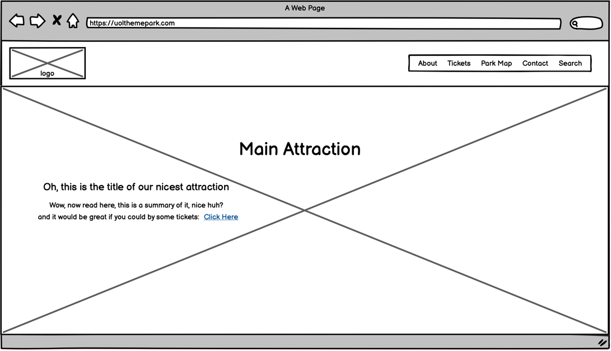
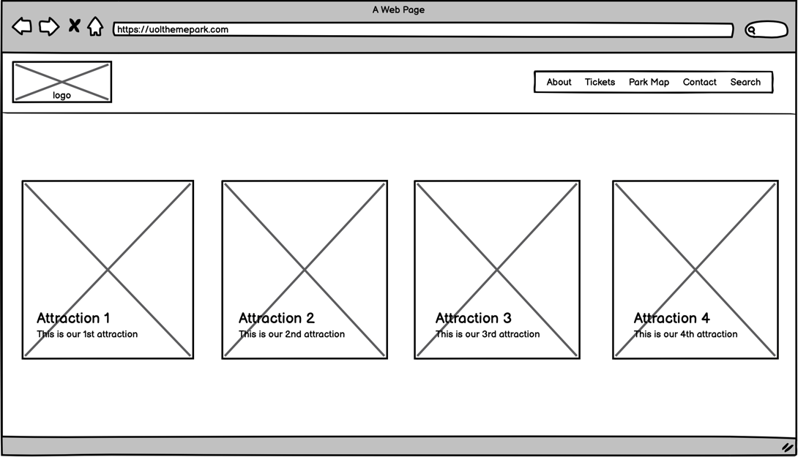
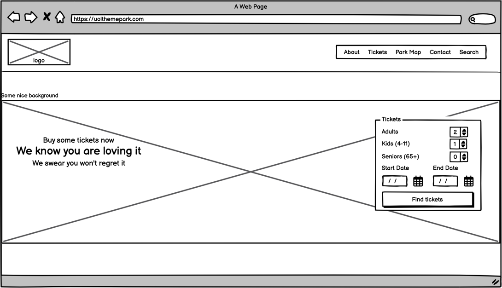
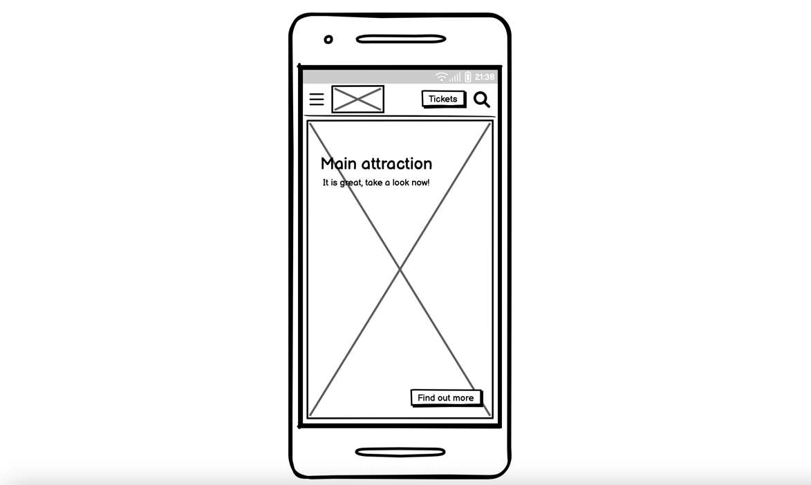
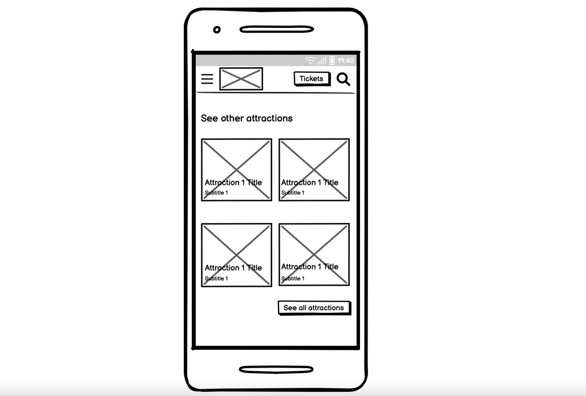
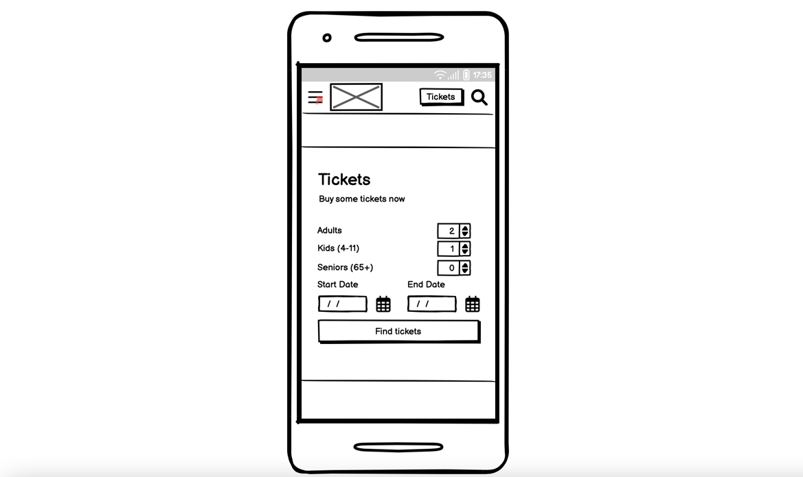

## 1 - Reasons for a theme park to have a web site
### Points to discuss
- Presence online
- Keep customer informed about activities, current ones or oncoming ones.
- Sell tickets online.
  - Probably increasing the amount of tickets sold
  - Giving customers a better option to buy a ticket without a long waiting queue
  - Customer can buy tickets for oncoming activities
- Attract customer from long distances, tourists etc.
- Marketing: Having a subscripton system

## 2 - Research

- [Asterisk Parc](asterisk_park/asterisk_park.md)
- [Europa Park](europa_park/europa_park.md)

### Aspects of the sites that you think are a good idea
- Have the current or main attraction right at the home, well highlighted.
- Divide the site into sections so the user can scroll down to what attractions are availaboe
- A ticket section in the middle so the user can see some dates and prices
- A top menu with a few items
- Bottom apps and information about the park
- Awards
- A summarised info of what's in, like "13 rollercoasters, hotels, 150 restaurants"

### Aspects of the sites that you don't think are so successful.
- Have more than one menu
- Having lots of options
- A pop-up linking to the info's page at the place a chat would be.
- Missing vital information at the homepage, like the park address
- Too many sections (maybe)

## 3 - Agree on the content for the web site
### Attractions
- Information about the park, why it is cool, etc.
- Seasonal attractions.
- Holiday attractions, e.g.: Halloween, Christmas, Winter
- Attractions for both kids & adults
### Food
- Different kinds of restaurants
- Maybe thematic restaurants
### Information
- Main attraction highlighted
- All Attractions
- Localisation of the park, city, etc, opening hours
- Options for transport if needed/Parking info
- Park Map, highlighting important things as toilets/atms/medical assistance
- Summarised info about all what the park have e.g.: X number of restaurants, Y rollercoasters
- Tickets with prices

## 4 - Site Structure
- I think it's a good idea using this kind of homepage divided into sections
where you can scroll down.
- A main menu at the top of the website
- Information at the bottom like apps of the park if it has, the address, opening hours
and all contacts
- The main menu must have the option for tickets, park map.
- For mobile version the site can place things on the top of each other if needed,
as it is a cool way of displaying stuff, of course, in a smaller/thumbnail version of the thing.
- Maybe some items of the menu can be linked to the sections instead of other pages
so we can have a menu with some sort of quick options as well.
- 3 main pages: home, site map, tickets

## 5 - Wire frames
### Suggestion
- Home:
- 
- First Section - Attractions
- 
- Second Section - Tickets
- 
- Mobile Home:
- 
- Mobile First Section - Attractions
- 
- Mobile Second Section - Menu
- 
- Mobile Third Section - Tickets
- 
- [Demo Link](https://balsamiq.cloud/su76wx6/p5gmmcb)