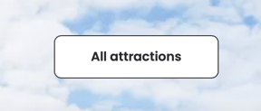

### 1 - Asterisk Park - France

#### Computer Browser Version
- 
- As soon as you open it, you can see a main Menu at the top, with 5 options,
  and the current main attraction of the park:
- 
- Submenu:
- 
- Then it has three more options: FAQ, Search, and Book Now:
- 
- Scrolling down you have more information about the park, and special offers:
- 
- 
- Keep scrolling and you'll have a news section:
- 
- Then more attractions:
- 
- And it has a button All Attractions:
- 
- Now more info about adventures and the Park Hotel:
- 
- 
- Finishing with reviews, apps and web site bottom
- 
- 
- Clicking on book now you have a pop-up:
- 

The homepage covers a lot of information, separating then vertically.
The main menu also has a lot of options, having the main ones as the:
- The Parc
    - Attractions
- Practical Information
    - Schedules and Calendar
    - Park Map
- Book Now pop-up
- Adventure

I'm not going into detail, but if I had to narrow down to indispensable options
I'd have the Home Page, Attractions, Schedule And Calendar, Park Map and Tickets.
The web site has a Chat Option as well, which is very important in my option.

#### Mobile Browser Version
- The web site has the same structure
- 
- But the menu is hidden:
- 
- Some information is grouped and side buttons turn into top/bottom buttons:
- 
- The special offers are grouped one on the top of another:
- 