### 1 - Europa Park - France

#### Computer Browser Version
- https://www.europapark.de/en/park
- 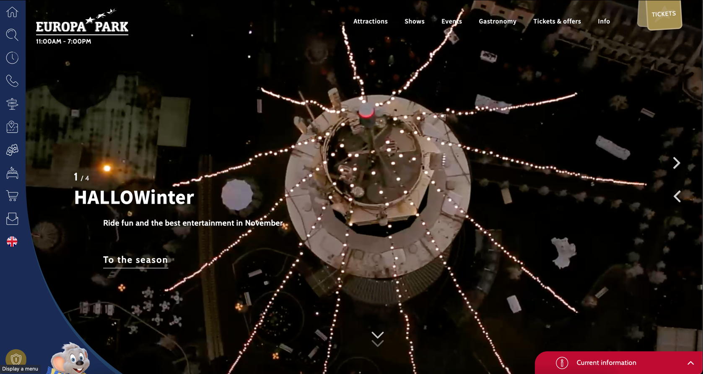
- 
- Its home has the main or current attractions, and its possible to navigate
by two buttons on the right:
- 
- It has the same vertical page structure, with different sections being shown as
you scroll down.
- General information of what's in the park and options to buy tickets:
- 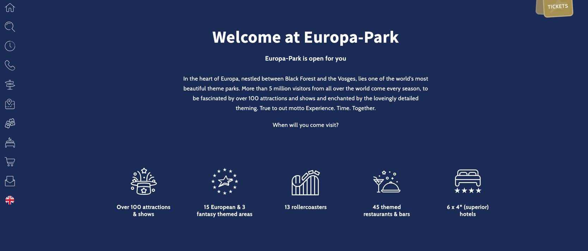
- 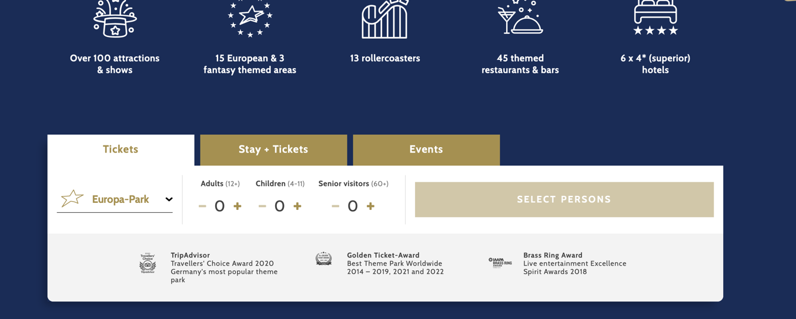
- Kind of news section:
- 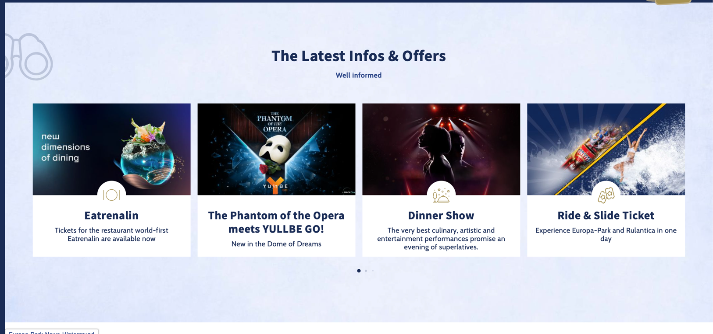
- Attractions:
- 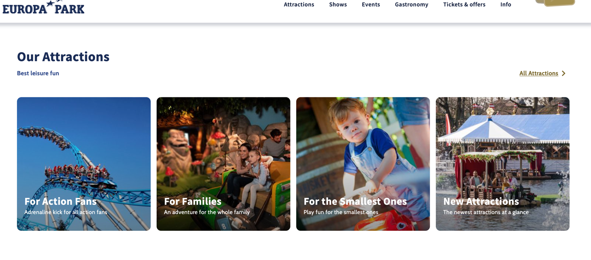
- With a link to All Attractions:
- 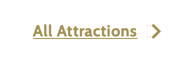
- Then it has shows:
- 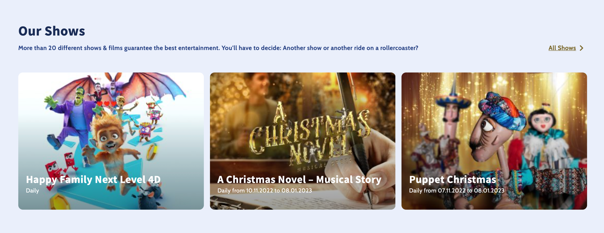
- Another tickets section:
- 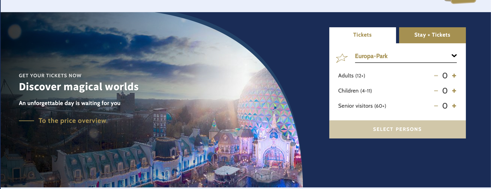
- Restaurants:
- 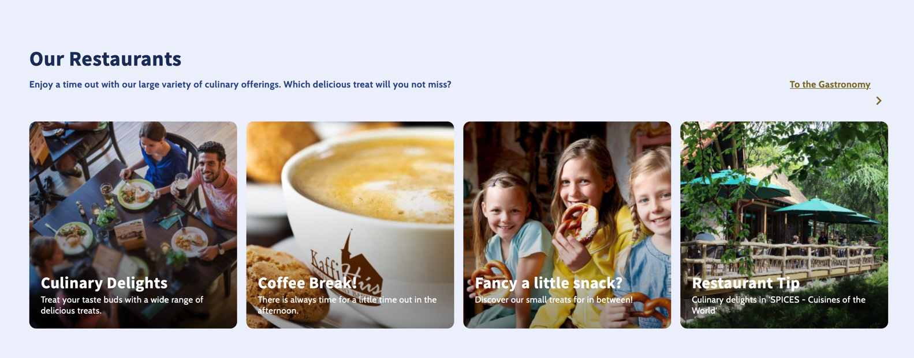
- A Link to the interactive park maps:
- 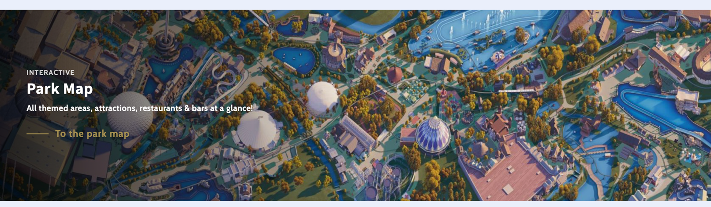
- A third section of tickets but having a few kind of specific options:
- 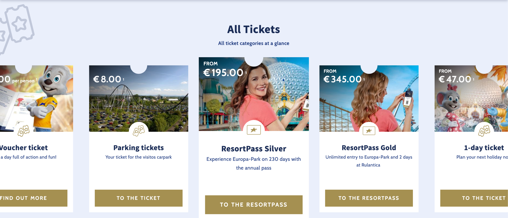
- Option to download the mobile app:
- 
- Park awards:
- 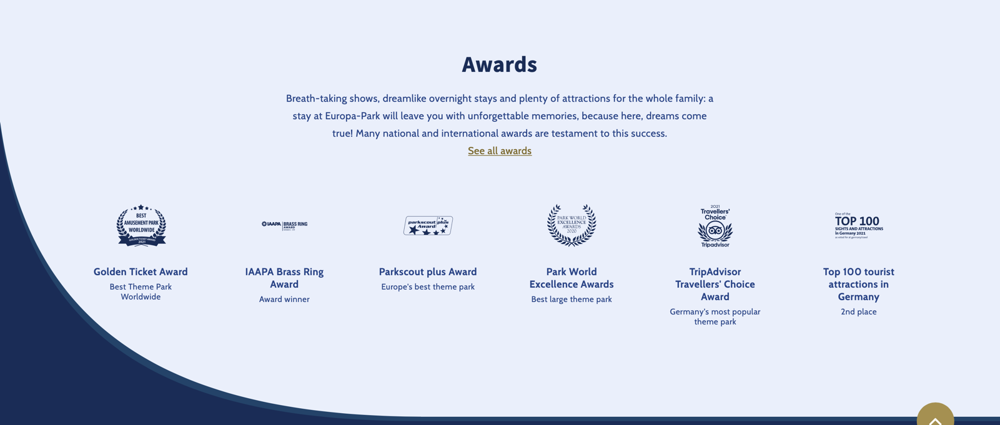
- and the bottom with general information about the park:
- 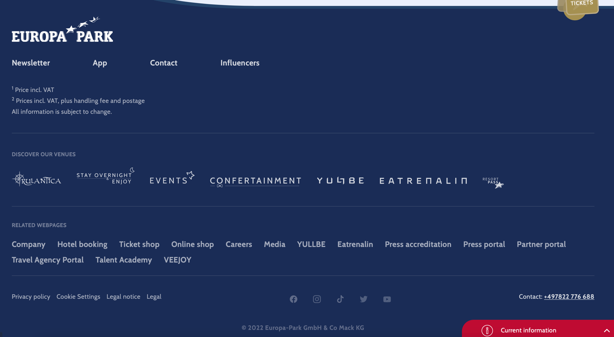
- It has a top menu, with a few items and subitems:
- 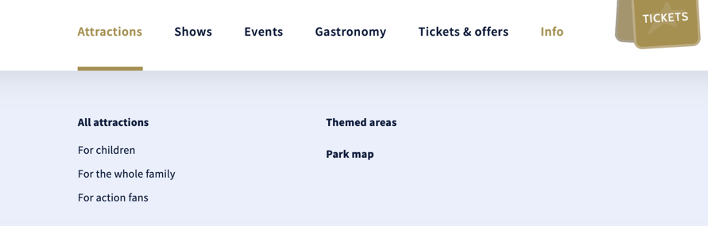
- and an option for buying tickets:
- 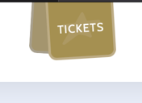
- Also a left menu with quick options:
- 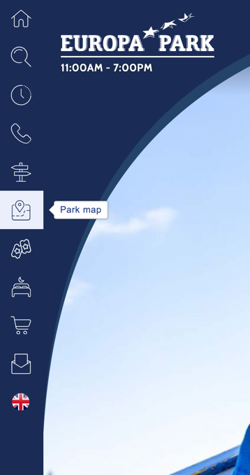

#### Mobile version
- on mobile version the main section continues similar to the Desktop one,
but you can see four little dots to navigate
- 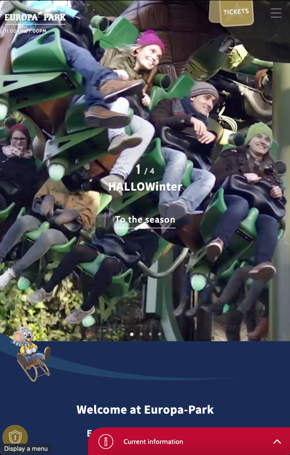
- The tickets section changes a bit:
- 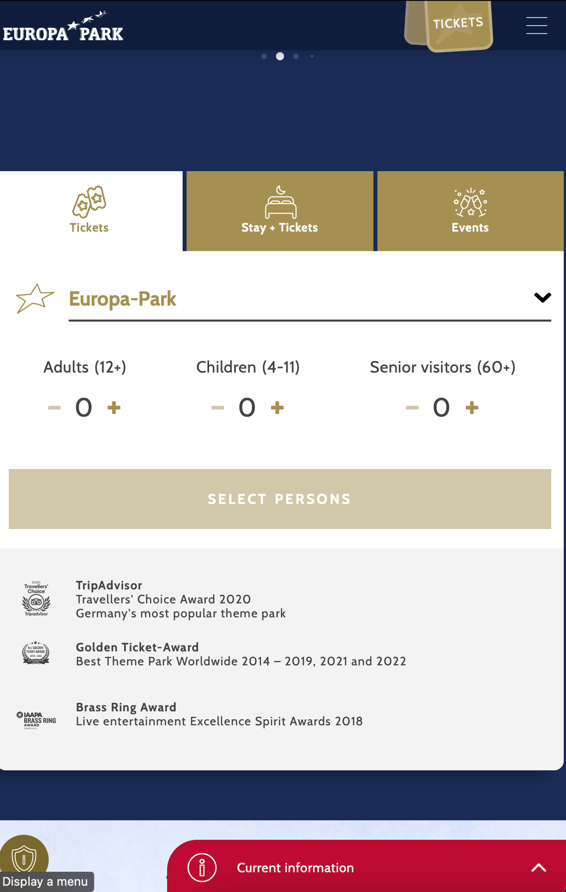
- The info & offers section are displayed in a way you can navigate kine of "sliding" it:
- 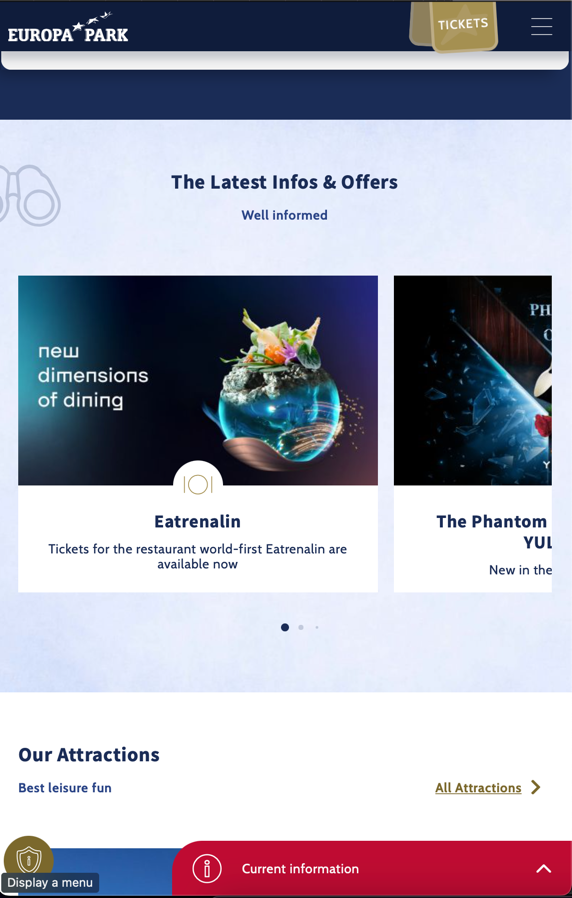
- But the attractions sections is grouped with the item on the top of each other:
- 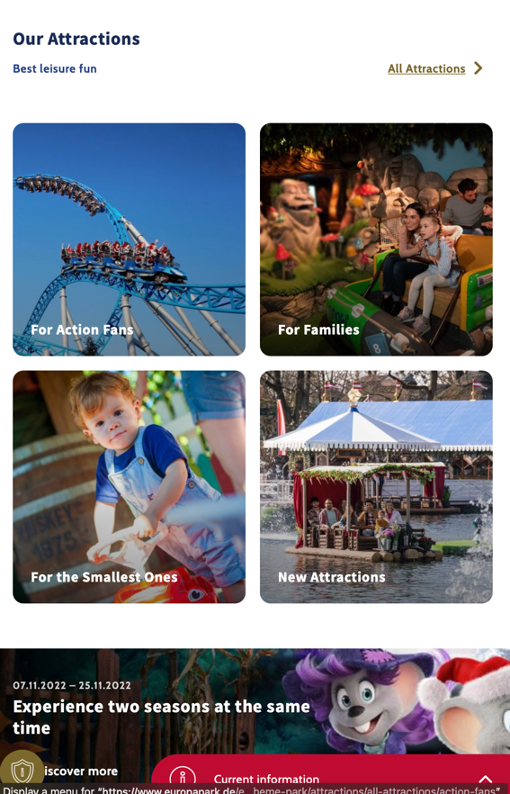
- The left sidebar disappears and the main menu is displayed on the right:
- 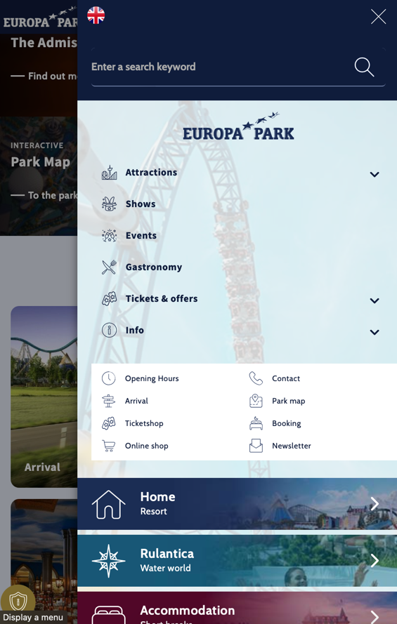
- This now has also the same items of the sidebar menu as the quick options:
- 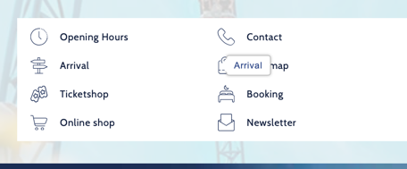

---

