### 1 - Asterisk Park - France

#### Computer Browser Version
- 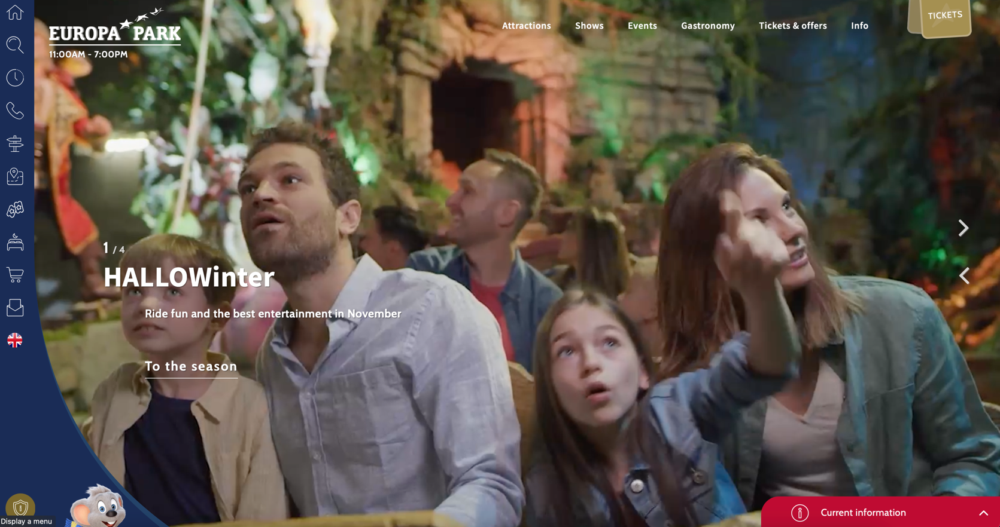
- Its home has the main or current attractions, and its possible to navigate
by two buttons:
- 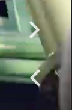
- It has the same vertical page structure, with different sections being shown as
you scroll down.
- General information of what's in the park and options to buy tickets:
- 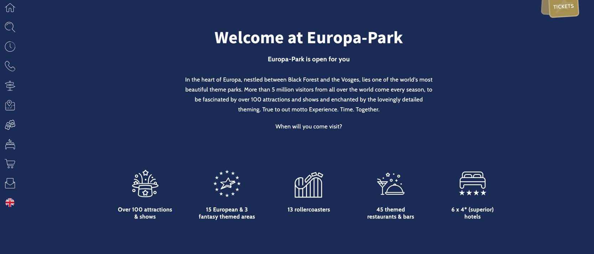
- 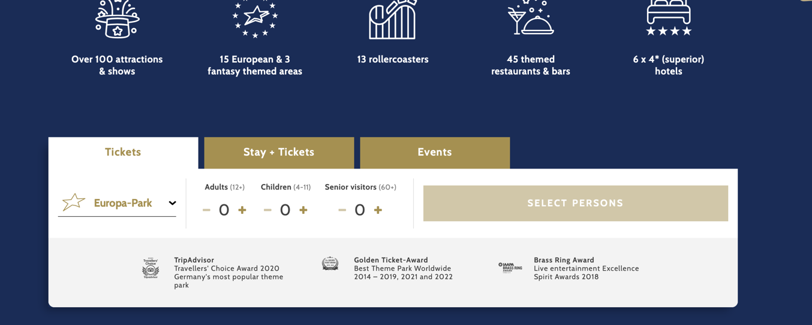
- Kind of news section:
- 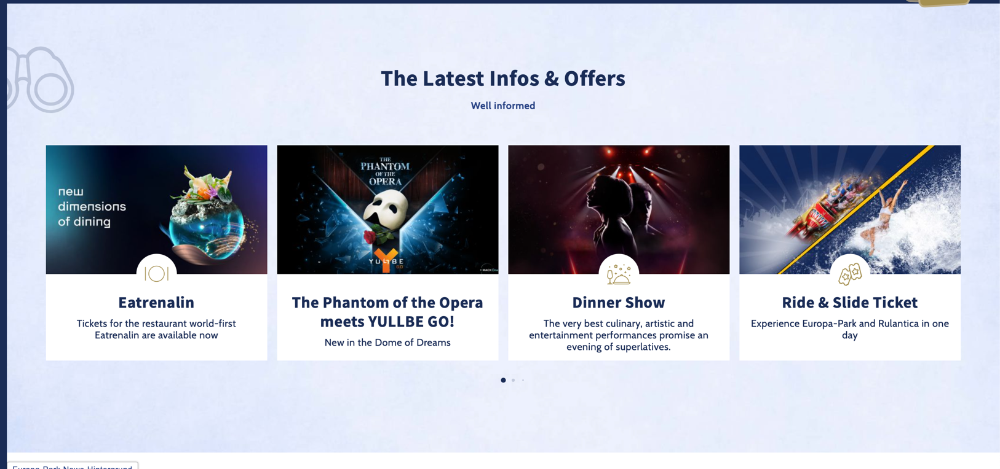
- Attractions:
- 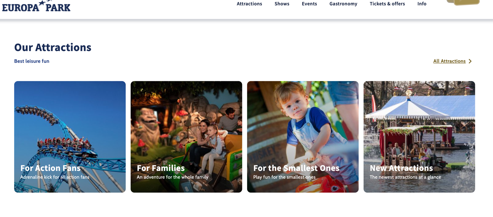
- With a link to All Attractions:
- 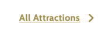
- Then it has shows:
- 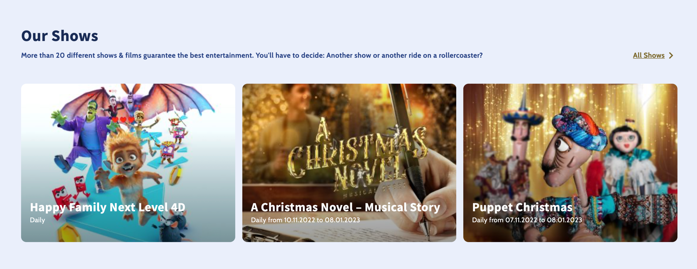
- Another tickets section:
- 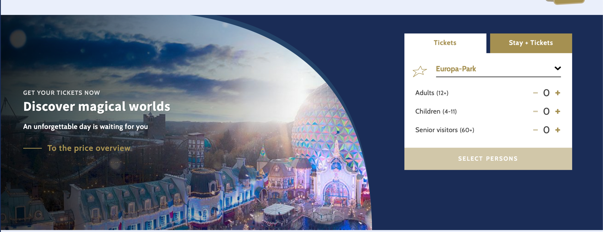
- Restaurants:
- 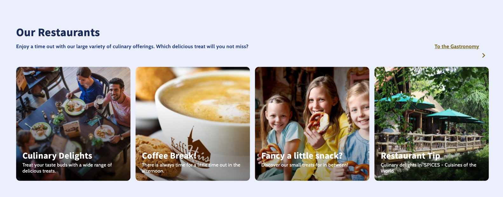
- A Link to the interactive park maps:
- 
- A third section of tickets but having a few kind of specific options:
- 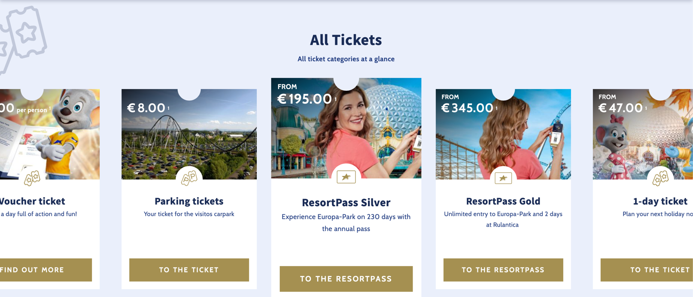
- Option to download the mobile app:
- 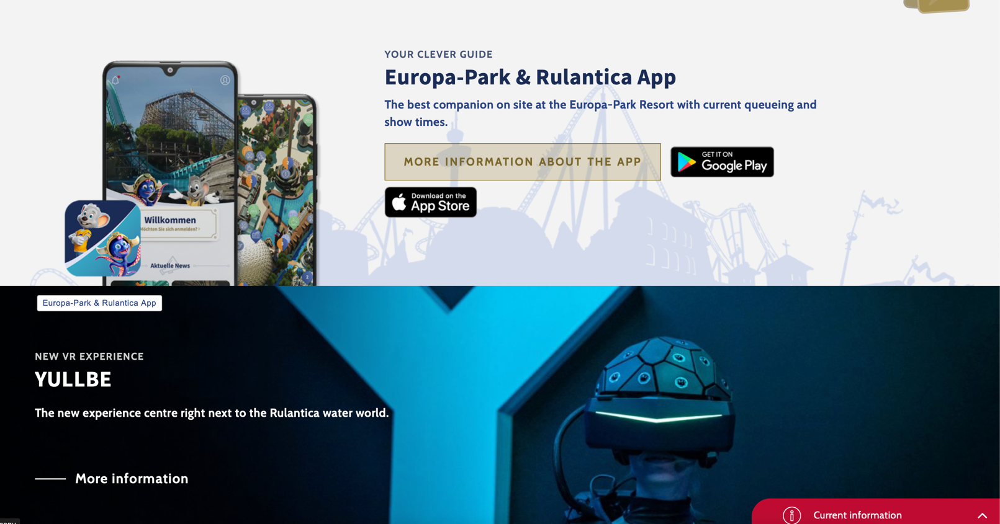
- Park awards:
- 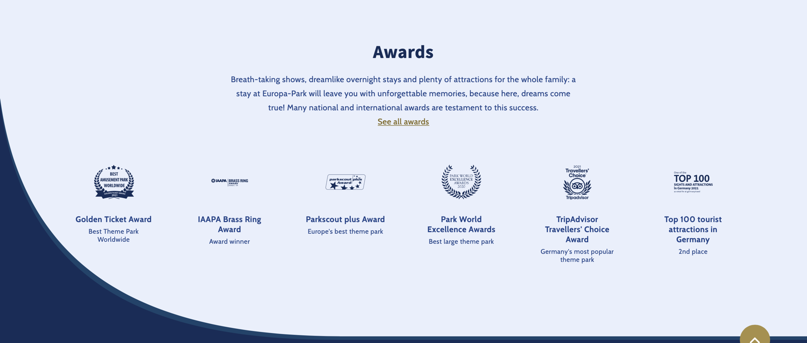
- and the bottom with general information about the park:
- 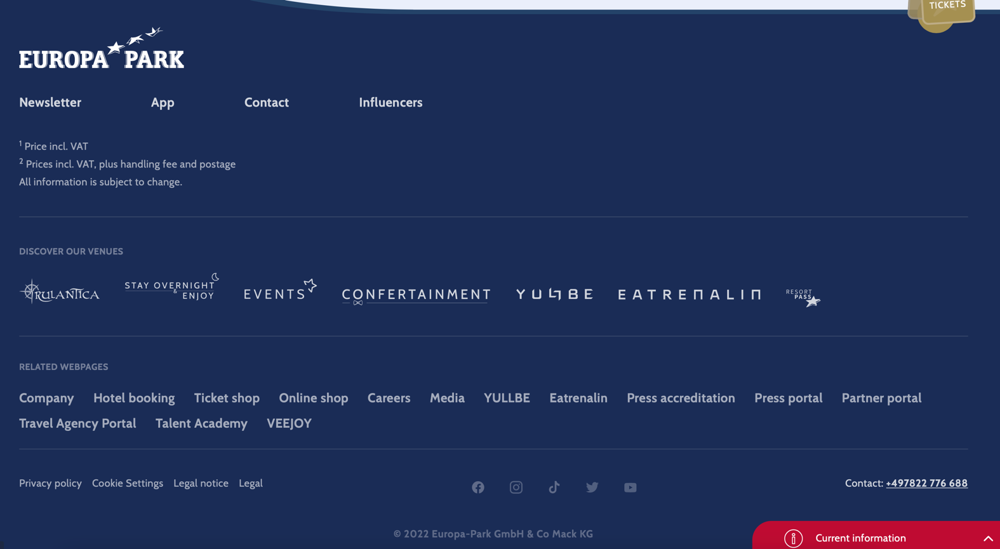

TODO: describe the menus and the mobile version